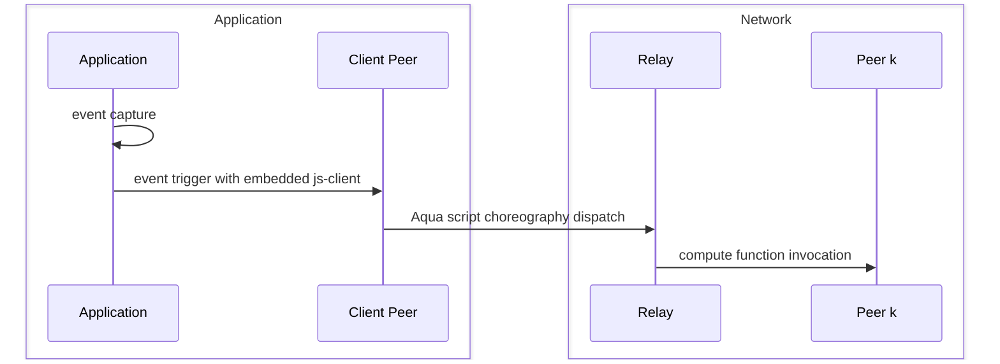
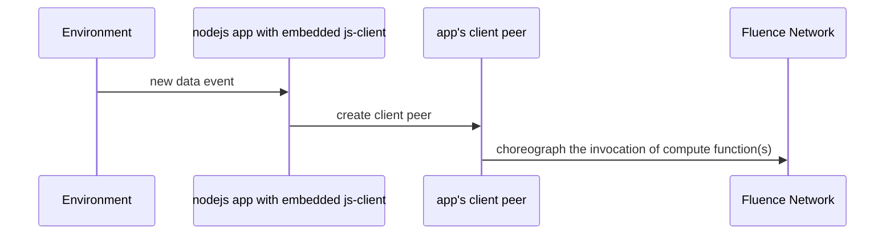

# JS

Fluence Cloud Functions are hosted on distributed peers in the Fluence network waiting to be called. That is, your functions need to be triggered in order to do some work. Event triggers may arise from a multitude of sources ranging from browser click-events to changes in a database column. Regardless of the source, the event needs to trigger the function(s) which, as you already know from the introduction and quickstart chapters, requires Aqua to orchestrate the invocation of your distributed compute function(s).

One way of triggering the orchestration of your function(s) is interactively with the Fluence CLI: `fluence run -f 'your function(args)'`. However, events may require (near) real-time processing which in turn requires the orchestration of your function(s) immediately after the event occurred. Whether this is in the browser or some other application, we need to trigger the appropriate Aqua script from a (embedded) client peer. 

The [js-client](https://github.com/fluencelabs/js-client) provides this functionality and can be used in your frontend web app or nodejs application to provide the connection to the Fluence network via a relay peer. See Figure 1.

Figure 1: Using js-client to trigger compute function
mermaid

## Frontend Appliations With The JS Client

With Fluence CLI we can easily scaffold a frontend application enabled to trigger the invocation of remote compute function(s). Before we dive into the code, we need to:

* scaffold a frontend application with Fluence CLI
* create or reuse compute function(s) that need to be triggered
* create or reuse an Aqua script to choreograph remote compute function(s)

**TODO**: Akim, please fill in from your code. ideally, just do a plain hello world:

    * a front end app with a styled text box taking the name and submit button
    * extend that example with a par hello world; say three input boxes and three compute functions
    * if time permits extend the example and send the hello world output(s) to another browser which requires more frontend input to find the other browser/client peer

## NodeJS Application

`js-client` easily embeds into any nodejs application to invoke remote compute functions. For example, your nodejs application maybe processing sensor inputs on an IoT device or scan a database for changes. See Figure 2.

Figure 2: Triggering Compute Functions with js-client

**TODO**: Akim, please redo the hello world example from above with a "fake" sensor input generator providing one or more names for the remote hello world function. e.g., every 2 to 15 seconds the "environment" produces one or more names (randomly chosen from an array of names, for example). Depending on the number of name params, call remote in seq or par.

## Time-Based Triggers

In addition to event-based triggers, we often encounter trigger requirements based on time, such as cronjobs. The Fluence Scheduler is well equipped to handle such requirements and is extensively documented **here** 

**TODO**: link to maria's document.

## Summary

In this chapter we covered non-interactive, event handling from the browser and nodejs applications with `js-client`. See the [js-client repo](https://github.com/fluencelabs/js-client) for more info.

